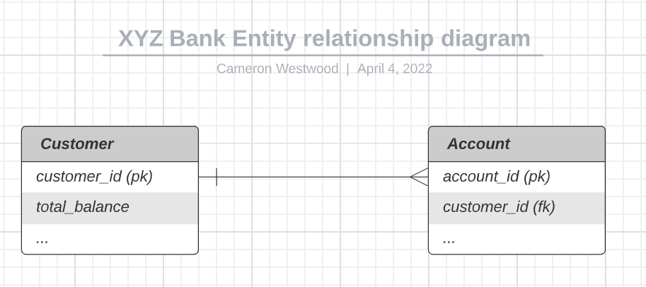
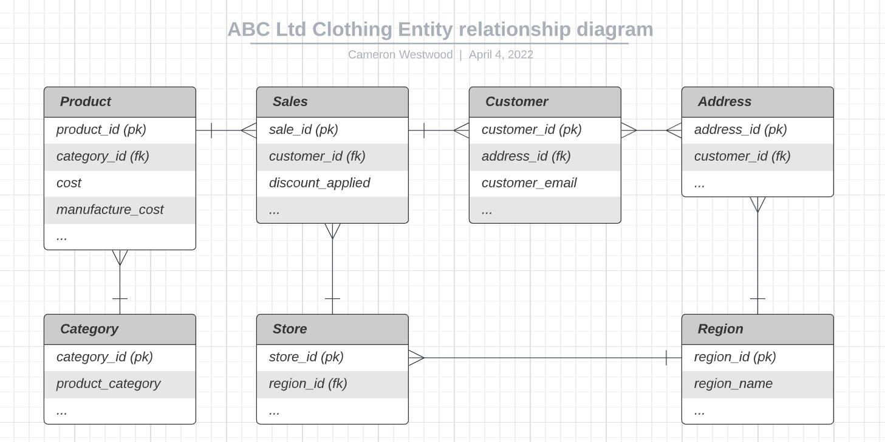

# Hargreaves Lansdown Tech Task


Please find a .docx version of these answers here if preferred: [hargreaves_lansdown_tech_task.docx](hargreaves_lansdown_tech_task.docx)


* [Task 1 - XYZ Bank](#task_1)
* [Task 2 - XYZ Bank (SQL query)](#task_2)
* [Task 3 - XYZ Bank (SQL query to return customers with no accounts)](#task_3)
* [Task 4 - ABC ltd Data Warehouse model](#task_4)
* [Task 5 - Data stage process](#task_5)
* [Task 6 - IMDb Python task (link to code)](#task_6)


## Task_1


I would set up the Customers in one table and Accounts in another table so that the data is normalised and ensure that there is a one-to-many Foreign key link between the two tables so that we can link customers to their accounts without duplicating the customer’s details in the database (see entity relationship diagram below): 




## Task_2 

XYZ Bank (SQL query to return customers with multiple accounts)

```
SELECT a.customer_id, c.total_balance, COUNT(a.customer_id) AS no_of_accounts
FROM accounts a
INNER JOIN customers c ON (s.customer_id = a.customer_id)
GROUP BY a.customer_id
HAVING COUNT(a.customer_id) > 1
ORDER BY no_of_accounts DESC;
```

## Task_3

XYZ Bank (SQL query to return customers with no accounts)

```
SELECT a.customer_id
FROM accounts a
WHERE a.customer_id NOT IN
    (SELECT c.customer_id 
     FROM customer c);
```

OR

```
SELECT a.customer_id
FROM accounts a 
WHERE NOT EXISTS 
    (SELECT * 
     FROM customer c
     WHERE c.customer_id = a.customer_id);
```


## Task_4

ABC ltd Data Warehouse model:

I would design the Data Warehouse to have a product table with a list of products, those products would have the associated costs in that table (i.e. the cost of production and sale price), all products would have an associated record in another table called Product category, where one product has a single could potentially have multiple associated categories, depending on the category definitions and how the user wishes to categorise products. 

I would have another table for Sales/orders, which could take both online orders and in-store purchases into consideration, recording any discounts applied. For online transactions, this table should be linked to a Customer/Account table, which could be utilised also if customers opt to give their personal details in-store or have an online account. If that is not the case, I would have a table for Stores, which link the store to a Region table, containing region breakdowns for assessing the most profitable products per region.

In the event that the sale is an online sale, the customer account will have a linked address for delivering the products to, These addresses could then be used to map all online purchases to an associated Region to be able to break-down regional data for online sales. This could be a many-to-many relationship (i.e. one customer could have several addresses linked to an account and there could be multiple customers registered to one address).

It is worth mentioning that, I could make use of further mapping tables (such as if the user wishes to map their sales to different region breakdowns or products to multiple category types), to further normalise the data if needed (see entity relationship diagram below):




## Task_5

A data stage process was previously taking 10 minutes to run.  Now it’s taking an hour to complete.  Detail the possible causes and how you would determine which was responsible

There are many things that could be responsible depending on the data stage process in question, such as a spike in data volume or not optimised code or database setup, issues with the data or transformations or a technical issue. The first thing that I would check would be the process logs to get better details as to why the process is taking significantly longer to run and see which aspect was causing the bottleneck.

A process taking magnitudes of time longer could be indicative of API issues if they are being used, it may be worth looking into whether any processes are hitting the API too often and causing the process to be slow.

If the issue is on the database side, I would review the process around that, we could add further query optimisation, adding further indexing and building the database in a way that. We could add partitions to large tables, or try loading data in batches and only loading deltas or data that has changed or been added. If the process isn’t already, we can look at asynchronously running parts of the process or any data loads to see if this speeds this up. We could similarly look at data caching to speed up processes if the volume of data being transformed/loaded is particularly large and this is the cause for the slowness. 

Additionally, it may be worth looking at the resources allocated to the task and further monitoring these, as well as monitoring the time taken to run processes so that we can bet a better understanding of any issues or increases in data. It may be pertinent to run the machine on an ‘elastic’ serverless compute engine (such as ECS or a fully managed Fargate instance) if the issue is either an unforeseen increase in traffic/data volume, as well as set up alerts on the monitoring so that we can quickly diagnose any issues or bottlenecks and ensure that processes remain performant. 

We could have a look at the scheduling of the task if it is running at a particular time which is impacting the performance and even potentially looking at a trigger event to set off the process so that the task runs more regularly with less data and is less impacted by running at times that may impact use. 


## Task_6

I've created this in Python using PyCharm IDE, using the dataset available here: https://datasets.imdbws.com/

The only package requirements are Pandas.

Link to Python code:

* [IMDb code](task_6_imdb_code/)

* [main.py file](task_6_imdb_code/main.py)

Pseudo code version
